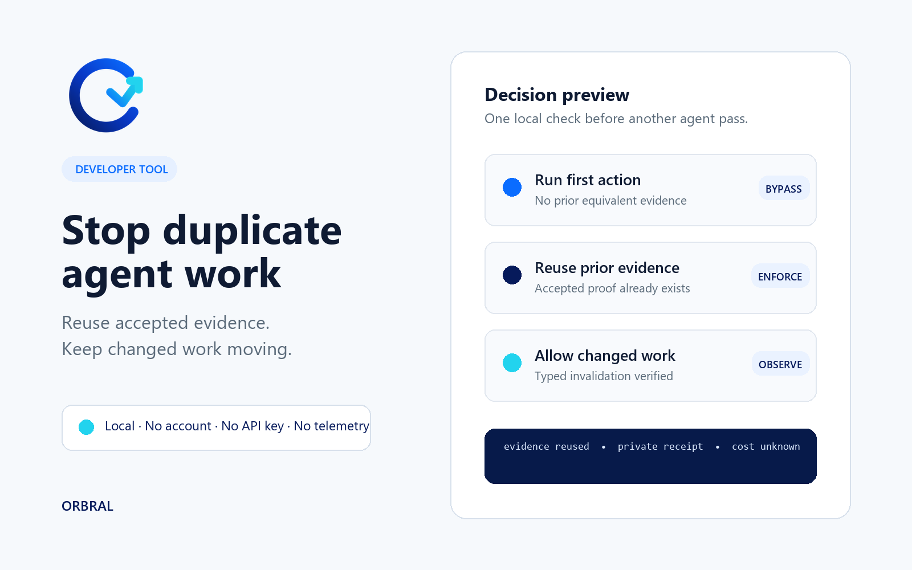

<p align="center">
  
</p>

# Agent Churn Control

**Stop duplicate agent work.**

Agent Churn Control prevents agents from rerunning equivalent tests, reviews, retries, tool calls, and promotion checks when accepted evidence already exists. It helps preserve model capacity without blocking valid changed work or weakening final verification.

It runs locally with no account, API key, telemetry, network call, hosted service, or model gateway.



## The problem

Long agent tasks often repeat work for reasons that do not make the work meaningfully new: a fresh attempt ID, another review request, a status poll, a retry after a deterministic failure, or a second broad test gate over the same candidate.

Agent Churn Control gives the host a deterministic decision before another pass:

| Decision | Meaning |
|---|---|
| `bypass` | Reserve and run the first complete action. |
| `observe` | Record accepted evidence, allow incomplete identity, or permit one valid changed-work invalidation. |
| `enforce` | Reuse accepted evidence, repair a deterministic failure, or block only the duplicate local action. |
| `promotion_gate` | Verify frozen release evidence without publishing or installing. |

Rate-limit signals remain advisory at every state. They never stop an otherwise valid task by percentage, missingness, or staleness alone.

## Install

### Codex plugin

```text
codex plugin marketplace add SpannDaMan/agent-churn-control
codex plugin add agent-churn-control@agent-churn-control
```

Start a new Codex task after installation so the bundled skill is loaded.

### Clone and test

```text
git clone https://github.com/SpannDaMan/agent-churn-control.git
cd agent-churn-control
python plugins/agent-churn-control/scripts/churn_control.py self-test
python plugins/agent-churn-control/scripts/churn_control.py verify-package
```

The runtime uses only the Python standard library.

## First decision

```text
python plugins/agent-churn-control/scripts/churn_control.py decide \
  --event plugins/agent-churn-control/assets/sample-event.json \
  --state .agent-churn-control/receipts.ndjson \
  --output reservation.json
```

The first decision is a pending reservation, not a pass claim. Run the authorized action, hash its accepted evidence, and promote that reservation:

```text
python plugins/agent-churn-control/scripts/churn_control.py accept \
  --event plugins/agent-churn-control/assets/sample-event.json \
  --reservation reservation.json \
  --evidence-digest sha256:<64-hex-evidence-digest> \
  --state .agent-churn-control/receipts.ndjson \
  --output accepted-receipt.json
```

Then verify the accepted receipt:

```text
python plugins/agent-churn-control/scripts/churn_control.py verify --receipt accepted-receipt.json
```

The first complete solo action returns `bypass` with `outcome: pending`. Only a linked acceptance receipt with an evidence digest can become reusable. Give each later action request a new `event_id`; an equivalent request then returns `reuse_prior_evidence`. Concurrent callers share a cross-process state lock and re-read state before append, so only one caller can claim the first action while the others are held at the local-action boundary.

## Evidence and privacy

- Work identity binds action scope, requirements, candidate, dependencies, policy, evaluator, and environment.
- An allow decision is only a pending reservation; it cannot be reused until accepted evidence is linked back to that receipt.
- Carrying a prior result forward after an identity change requires a typed, single-use invalidation bound to the prior receipt, actual before/after values, and action scope.
- External identifiers are retained only as SHA-256 digests.
- Receipts reject prompts, outputs, commands, logs, file contents, secrets, credentials, participant identities, and absolute paths.
- Unknown usage or cost stays unknown. Numeric savings require comparable authoritative basis receipts.

## What it does not do

Agent Churn Control does not call models, route providers, host a service, publish, install itself, change permissions or scopes, access credentials, guarantee savings, or stop the overall task. Its enforcement applies only to the named local action.

## Validate

```text
python -B -m pytest -q -p no:cacheprovider
python plugins/agent-churn-control/scripts/churn_control.py self-test
python plugins/agent-churn-control/scripts/churn_control.py verify-package
python tools/validate_release_candidate.py
```

The public fixture corpus covers first actions, exact replay, evidence reuse, typed invalidation, deterministic failure, rate-limit states, fan-out, promotion, unknown metrics, timeout, rate-limit retry, and partial-result handling.

## Documentation

- [Codex installation](docs/CODEX-INSTALL.md)
- [Decision and receipt model](docs/DECISIONS-AND-RECEIPTS.md)
- [Evaluation](docs/EVALUATION.md)
- [OpenAI submission packet](docs/OPENAI-PLUGIN-SUBMISSION.md)
- [Privacy](PRIVACY.md)
- [Terms](TERMS.md)
- [Security](SECURITY.md)
- [Support](SUPPORT.md)
- [Threat model](THREAT-MODEL.md)

## Evidence boundary

The release is backed by synthetic engineering evaluation and deterministic local tests. That evidence does not establish customer demand, conversion, retention, willingness to pay, guaranteed savings, or a causal model regression.

## License

MIT © 2026 SpannDaMan. See [LICENSE](LICENSE).
